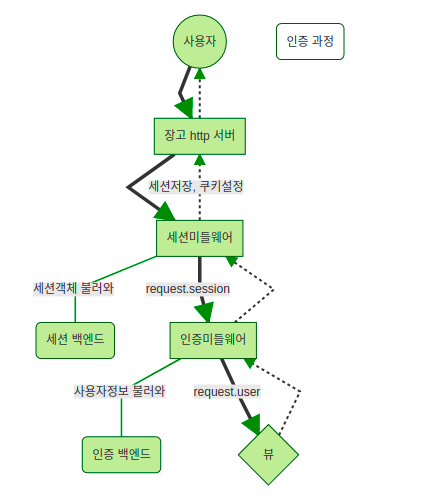

# My Place Record(마플레)

###  프로젝트 기간
21.06.03(수) ~ 21.06.16(목)

### 개요
개인프로젝트로 spotter이라는 어플을 벤치마킹하여 내가 좋아하는 장소 기록하고 관리하는 웹 사이트입니다.   

### 구현 기능
#### 백엔드
- github projects로 일정관리
- 모델 설계 및 ERD 작성
- 로그인 / 회원가입
  - 이메일 인증
  - 이메일 재발송(추후)
  - 소셜로그인 api(추후)
  - JWT (추후)

- 장소 CRUD
  - create
  - read
  - update
  - delete

- 소셜 기능(추후)
  - 팔로우 / 언팔로우
  - 댓글 달기
  - 검색 기능
    - 지역별 / 고유명사별 / 태그별
  - 별점 달기
  - SNS 공유 api
  - 구글 맵스 api

#### 프론트엔드
- 메인 UI
  - 전체 / 맛집 / 카페 / 공원
  - 장소 포스트 출력
  - 등록한 장소 카운트
  - 로그인 or 간단 프로필

- 인증 UI
  - 회원가입 페이지
  - 로그인 페이지

- 프로필 UI
  - 마이 페이지(추후)

- 장소 포스트 UI
  - 해당 카테고리와 관련된 장소 포스트 페이지
  - 장소 디테일 페이지
    - 별점 / 설명 / 베스트 메뉴 / 추가 정보 / 사진
  - 장소 수정 페이지

### 사용기술
Python 3.8.5, Django, sqllite3, Javascript, HTML5, CSS3

### 새로운 기능
- 단일/멀티 이미지 업로드 기능
- 이메일 인증 기능

### 배운점
- User model 커스텀 하면서 장고 auth의 model(AbstractUser, AbstractBaseUser, BaseUserModel 등)을 이해해 볼 수 있었음
- 장고에서 제공하는 여러 뷰와 폼을 써보고 커스텀해보면서 장고를 더 알게됨(CreateView, LoginView, UserCreationForm)
- 이메일 인증을 구현하면서 인증체계에 대해 배워볼 수 있었음
</img> 
  - django.contrib.sessions.middleware.SessionMiddleware
  auth_login을 통해 생성된 세션 관리, 세션 유효 여부를 판단해서 유효한 경우, request객체의 session이라는 변수에 세션정보 저장
  - django.contrib.auth.middleware.AuthenticationMiddleware
  request.session값을 가지고 어떤 사용자인지 확인, 확인된 사용자는 request.user 객체에 해당 사용자의 모델 인스턴스 저장

### [문제해결]() (README.md에 기록할 예정)

### 참고
- https://play.google.com/store/apps/details?id=com.spotter.hotspot
- https://swarf00.github.io/2018/12/10/login.html#%EC%9D%B8%EC%A6%9D-%EB%AF%B8%EB%93%A4%EC%9B%A8%EC%96%B4